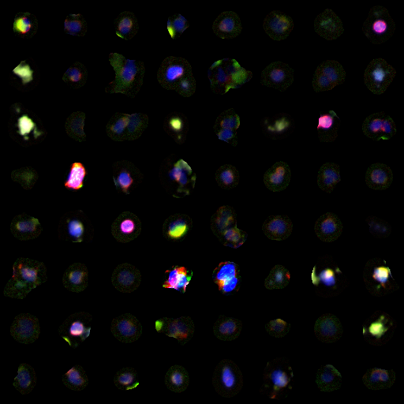
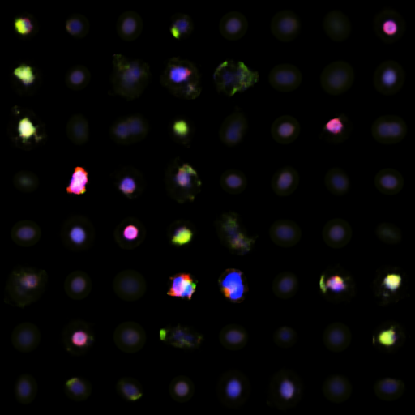
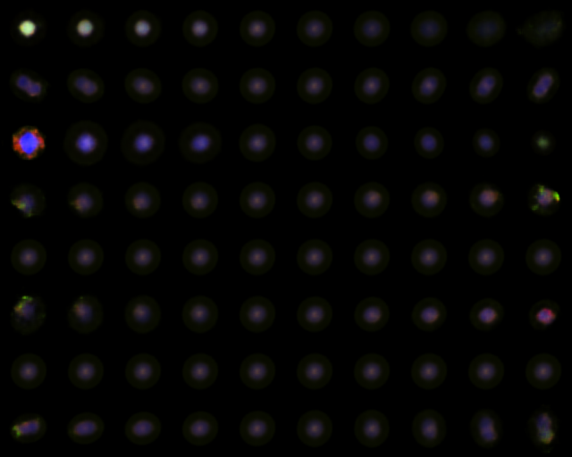

#	VAEcallback

This repository includes a custom keras callback to be used during training of a variational autoencoding model (ImageVAE).
At the beginning of training, this callback randomly samples input images from the data set and saves them as a square grid.
For each training epoch, this callback generates a sample grid of reconstructed input images that match the inputs, allowing rapid visual inspection of reconstruction quality.
Additionally, the callback generates a latent space walk visualization for each of the learned latent features, as detailed in Diederik Kingma's paper [Auto-encoding Variational Bayes](https://arxiv.org/abs/1312.6114 "Title")

##	Input vs. Reconstruction




These example images of input and reconstructed cellular images illustrate how VAEs learn optimal lossy compressions of input data.
In this example, input imagesa are reconstructed from only 8 learned features, illustrating the relative power of this type of model to signficantly reduce the dimensioanlity of input data.

##	Latent Space Walking



In this example figure, each row represents a single learned feature of the VAE model.
Because the VAE architecture encourages the distribution of the encoding features to conform to a given prior (typically standard normal), individual features may be explored by holding all other features to their expected value (typically zero).
These synthetic latent encodings are then passed through the VAE decoder network to generate synthetic images that collectively capture the effects that individual features have on reconstructed images.
Each column thereby represents a different point along the unit CDF of the standard normal prior before being passed through the decoder network.

##	Animated Learning


Training can be visualized by generating animated gifs of both reconstruction and latent feature space during training.
In this example, the model is trained for several hundred epochs, which appears to visually converge.

##	Usage

The callback is very simple to use with the ImageVAE class, which is simply instantiated with the ImageVAE model parameters.

```python
vaecb = VAEcallback(self)
history = vae.fit_generator(train, callbacks=[vaecv])
```


